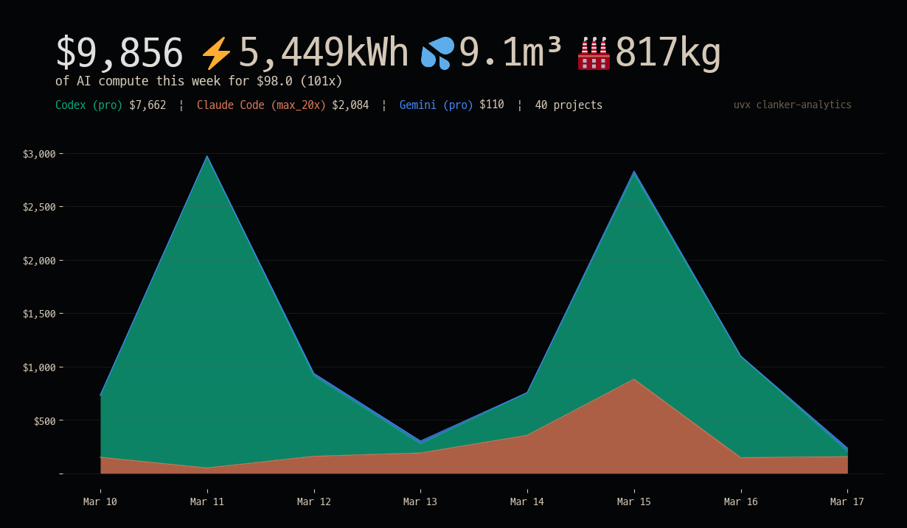
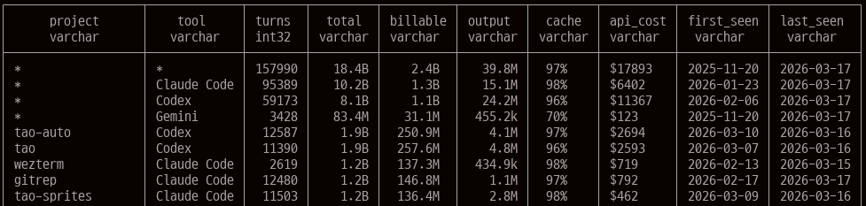

# clanker-analytics

Token usage analytics for AI coding tools. Reads local session logs and shows per-project breakdowns using DuckDB.

Supports **Claude Code**, **Codex**, **Gemini CLI**, and **OpenCode**.




## Install

```
uv tool install clanker-analytics
```

Or run without installing:

```
uvx clanker-analytics
```

## Usage

```
clanker-analytics                        # 7-day chart (default)
clanker-analytics --since 24h            # last 24 hours (also: 7d, 2w, 2026-03-01)
clanker-analytics --share                # chart + copy to clipboard + open X
clanker-analytics --table                # tabular view
clanker-analytics --table --by date      # table grouped by date (also: model, session)
clanker-analytics --tool claude          # Claude Code only (also: codex, gemini, opencode)
clanker-analytics --refresh              # force cache rebuild
clanker-analytics --debug-timing         # print cache decisions and stage timings
clanker-analytics --profile              # print a cProfile summary to stderr
clanker-analytics --sql "SELECT ..."     # custom SQL against 'tokens' table
```

## How it works

DuckDB reads session logs directly from `~/.claude/projects/`, `~/.codex/sessions/`, `~/.gemini/tmp/`, and `~/.local/share/opencode/opencode.db` — no Python JSON parsing. Results are cached to `~/.cache/clanker-analytics/tokens.parquet` (ZSTD compressed) with a per-file manifest at `~/.cache/clanker-analytics/tokens-meta.json`.

The cache is incremental: unchanged source files are reused, changed files are re-read, and deleted files are removed from the cached table. A full rebuild only happens when the cache is missing, you pass `--refresh`, or the cache schema changes.

`--debug-timing` prints cache decisions and per-stage timings. `--profile` adds a Python `cProfile` summary; it is mainly useful for filesystem scanning and Python-side overhead, not DuckDB query execution time.

## Columns

- **total** — all tokens processed (input + output + cache write + cache read)
- **billable** — total minus the 90% cache read discount
- **output** — output tokens only
- **cache** — cache read hits as % of input tokens
- **api_cost** — estimated cost at API rates

## API cost calculation

The `api_cost` and `billable` columns use published API pricing. Cache reads are 0.1x the input token price for all providers:

| | Input | Cache read | Cache write | Output |
|---|---|---|---|---|
| Claude Sonnet | $3/MTok | $0.30/MTok | $3.75/MTok | $15/MTok |
| Claude Opus | $5/MTok | $0.50/MTok | $6.25/MTok | $25/MTok |
| GPT-5 / GPT-4 | $1.25/MTok | $0.125/MTok | (auto) | $10/MTok |
| Gemini Flash | $0.15/MTok | $0.0375/MTok | (auto) | $0.60/MTok |
| Gemini 2.5 Pro | $1.25/MTok | $0.125/MTok | (auto) | $10/MTok |
| Gemini 3.1 Pro | $2/MTok | $0.50/MTok | (auto) | $12/MTok |
| DeepSeek | $0.27/MTok | $0.027/MTok | $0.27/MTok | $1.10/MTok |

Sources: [Anthropic pricing](https://docs.anthropic.com/en/docs/about-claude/pricing), [OpenAI pricing](https://openai.com/api/pricing/), [Google AI pricing](https://ai.google.dev/gemini-api/docs/pricing), [DeepSeek pricing](https://api-docs.deepseek.com/zh-cn/quick_start/pricing)

## Environmental impact estimates

The `--chart` / `--share` output shows estimated environmental impact per million tokens:

| Metric | Per 1M tokens | Source |
|---|---|---|
| Electricity | 0.6 kWh | [Epoch AI](https://epoch.ai/gradient-updates/how-much-energy-does-chatgpt-use), [arxiv:2505.09598](https://arxiv.org/abs/2505.09598) |
| Water | 1 liter | [Li & Ren (2023)](https://cacm.acm.org/sustainability-and-computing/making-ai-less-thirsty/), adjusted for modern models |
| CO2 | 90 g | [Ritchie (2025)](https://hannahritchie.substack.com/p/ai-footprint-august-2025) |

These are rough estimates — actual impact varies 10-100x depending on model, hardware, and data center location. No provider publishes official per-token figures.

## Chart colors

Brand colors used in `--chart` / `--share` output:

| Tool | Color | Source |
|---|---|---|
| Claude Code | `#d97757` | [Anthropic brand guidelines](https://github.com/anthropics/skills/blob/main/skills/brand-guidelines/SKILL.md) |
| Codex | `#10a37f` | [OpenAI brand](https://openai.com) |
| Gemini | `#4285f4` | [Google brand](https://about.google/brand-resource-center/) |
| OpenCode | `#9b59b6` | OpenCode brand (purple) |

## Requirements

Python 3.13+, DuckDB 1.5+, matplotlib 3.9+.

Tested on Linux, macOS, and Windows (including WSL data auto-discovery).
