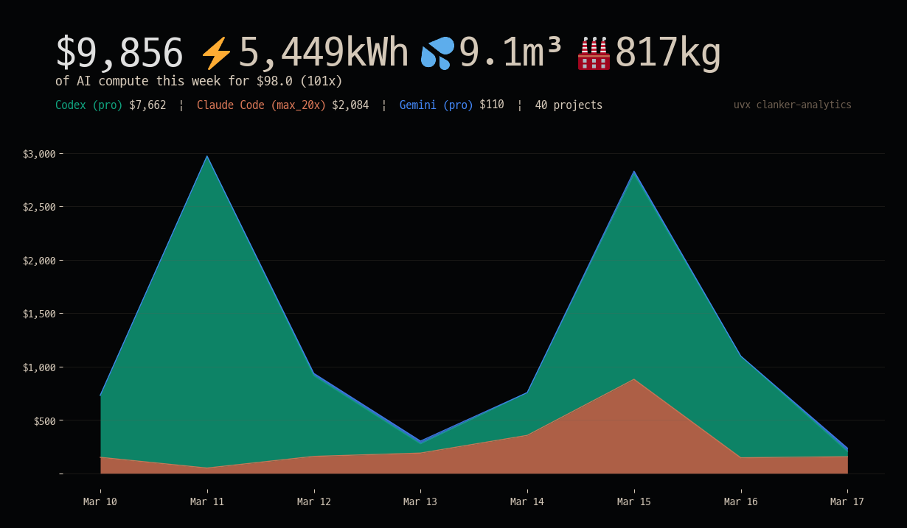
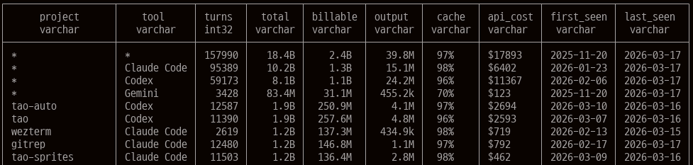
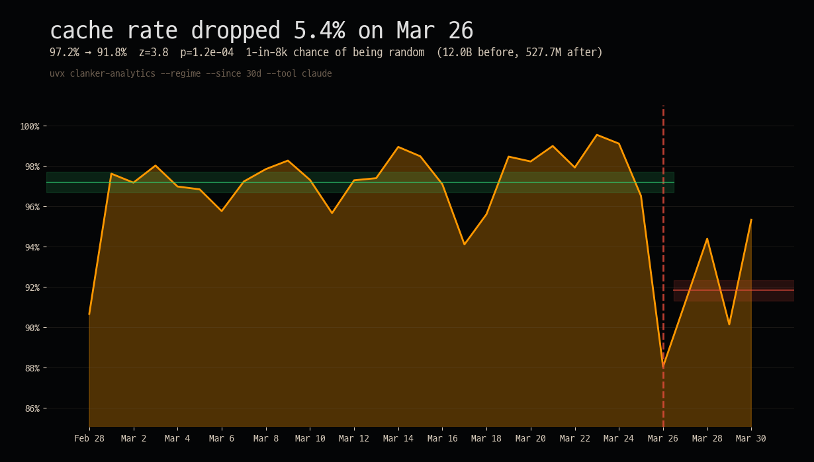

# clanker-analytics

Token usage analytics for AI coding tools. It reads local session logs and normalized runs from [Agent Orchestration Process (AOP)](https://github.com/wakamex/agent-orchestration-process), a tool for running bounded jobs across multiple agent CLI harnesses, then shows per-project breakdowns using DuckDB.

Supports Claude Code, Codex, Gemini CLI, Agy / Antigravity, and every harness recorded by AOP.





Worried your cache hit rate dropped? `--regime` auto-detects statistically significant changes using Welch's t-test: `clanker-analytics --regime --since 30d --tool claude`

## Install

```
uv tool install clanker-analytics
```

Or run without installing:

```
uvx clanker-analytics
```

## Usage

```
clanker-analytics                        # 7-day chart (default)
clanker-analytics --since 24h            # last 24 hours (also: 7d, 2w, 2026-03-01)
clanker-analytics --share                # chart + copy to clipboard + open X
clanker-analytics --table                # tabular view
clanker-analytics --table --by date      # table grouped by date (also: model, session)
clanker-analytics --table --by execution # interactive, exec, and subagent usage
clanker-analytics --regime               # detect cache rate regime changes
clanker-analytics --tool claude          # Claude Code only (also: codex, gemini, agy, aop)
clanker-analytics --record-quota         # retain current provider quota percentages
clanker-analytics pace                   # compare quota and local token pace at 1h, 6h, and 24h
clanker-analytics pace 5m 10m 15m        # arbitrary human-readable periods
clanker-analytics pace --quota-json      # versioned machine-readable comparison
clanker-analytics pace --all-buckets     # include inactive quota buckets
clanker-analytics pace --model-mix       # include the model mix column
clanker-analytics --quota-history        # audit every weekly Codex period in local logs
clanker-analytics --quota-history --quota-json
clanker-analytics --refresh              # force cache rebuild
clanker-analytics --debug-timing         # print cache decisions and stage timings
clanker-analytics --profile              # print a cProfile summary to stderr
clanker-analytics --sql "SELECT ..."     # custom SQL against 'tokens' table
```

## How it works

DuckDB reads session logs directly from `~/.claude/projects/`, `~/.codex/sessions/`, and
`~/.gemini/tmp/`. It also discovers retained `.aop/runs/*/result.json` records in the current Git
repository, neighboring repositories, and repositories nested one workspace level deeper. Results
are cached to `~/.cache/clanker-analytics/tokens.parquet` (ZSTD compressed) with a per-file manifest
at `~/.cache/clanker-analytics/tokens-meta.json`.

The cache is incremental: unchanged source files are reused, changed files are re-read, and deleted files are removed from the cached table. A full rebuild only happens when the cache is missing, you pass `--refresh`, or the cache schema changes.

## Quota pace comparison

`--record-quota` asks the installed Claude, Codex, and Antigravity usage packages for fresh quota
percentages and stores normalized snapshots in
`~/.local/state/clanker-analytics/quota.sqlite3`. The provider percentage remains authoritative and
includes activity that local session logs may miss. Claude and Antigravity history starts when the
recorder starts running. Codex session logs also retain embedded historical quota observations.

`pace` compares the observed percentage-point change with local token activity over each requested
period. Local tokens are converted to API-equivalent dollars by model and cache category. An
experimental token-derived percentage-point rate is calibrated from local API-equivalent usage in
the current provider window and the latest quota percentage. This is a diagnostic comparison, not a
replacement for provider quota history. It will diverge when local logs are incomplete, another
client or person uses the account, or provider quota weighting differs from public API pricing.

For a fixed window, the report calculates the remaining target pace as remaining quota divided by
hours until reset. Each lookback then shows uncapped projected utilization at reset and direct
guidance. `slow N%` is the reduction needed to match the target, `headroom N%` means the observed
pace is below target, and rates within 10 percent of target say `on pace`. A nonzero provider
quota-delta rate is authoritative. The token-derived rate fills in only when the provider percentage
is flat, because short intervals can hide activity through quantization.

OpenAI reports a concrete reset timestamp, which the adapter uses as its forecast boundary. Official
OpenAI documentation does not currently establish the subscription quota's fixed-versus-rolling
semantics, so the JSON identifies this fallback as `reported_openai_reset`. The Antigravity 5h and
weekly buckets are treated as fixed reset windows. Retained 5h observations show utilization
accumulating under one stable reset timestamp and dropping all at once at that boundary. Lookbacks
never cross a fixed-window reset. Codex buckets are also classified as fixed from retained rollover
evidence. Claude personal plans (`ai`, Free, Pro, and Max) use fixed session and weekly windows;
included-usage Enterprise plans use rolling windows. Unrecognized Claude plan metadata remains
unknown, and usage-based Enterprise accounts do not expose a bounded percentage bucket. Rolling and
unknown windows do not receive target or workload-change guidance. When those buckets have a
complete lookback, the terminal report labels their percentage-point rate as a net trend and states
why projection is unavailable.

The default periods are `1h`, `6h`, and `24h`. Pass any positive integer with `m`, `h`, `d`, or `w`
after the command, such as `pace 3h 7h`. Until enough snapshots have accumulated,
the corresponding row says `collecting history`.

The older `--pace --lookback 3h --lookback 7h` form remains accepted for compatibility.

The terminal report shows only complete lookbacks, meaning the selected historical sample covers
between 100 and 125 percent of the requested duration. Partial and still-collecting periods remain
available in `--quota-json` but are omitted from the default table. If a displayed bucket has no
complete periods, such as under `--all-buckets`, it says `No complete lookbacks yet.`

Buckets with no quota movement and no matching local tokens across every completed requested period
are hidden by default. Use `--all-buckets` to inspect them. A nonzero bucket remains visible while
history is still being collected because its recent activity cannot yet be classified.

The terminal table omits model mix by default. Use `--model-mix` to add it. Model mix remains in
the JSON report regardless.

## Codex quota history audit

`--quota-history` reconstructs every observed 7-day Codex quota period directly from local Codex
session files. For each period it uses the chronologically last nonzero quota observation, totals
native Codex token usage up to that observation, and reports:

- API-equivalent cost accumulated at the last observation.
- The implied full-quota API-equivalent cost, calculated as cost divided by used percentage.
- Change from the preceding estimate, cached-input share, model mix, and quality flags.

Codex emits slightly different reset timestamps into concurrent sessions, so reset timestamps are
rounded to a five-minute anchor when periods are grouped. Zero-percent fragments are skipped.
The report also removes inherited `token_count` events replayed into newly forked sessions. Without
that removal, local usage can be counted again every time a session is forked.
Codex timestamps are read as their original UTC strings instead of relying on JSON type inference;
otherwise timezone-less coercion can move activity across quota boundaries on non-UTC hosts.

All periods are repriced with the same immutable rate-card identity shown above the table. This
constant-price comparison keeps public API price changes from looking like quota changes. Models
without an explicit rate show `fallback_pricing`, non-default rate modes are flagged, and estimates
below 25 percent utilization show `early`. Those rows are useful leads, not strong quota-capacity
evidence.

The report reads the incremental Parquet cache. The first run may need one full source-file rebuild;
later runs update only changed files and query the complete history in one DuckDB aggregation. Codex
logs do not expose a stable account identifier, so users who switched or concurrently used multiple
accounts should not treat the combined result as account-specific.

To record every five minutes with a systemd user timer:

```sh
mkdir -p ~/.config/systemd/user
cp systemd/clanker-analytics-quota.* ~/.config/systemd/user/
systemctl --user daemon-reload
systemctl --user enable --now clanker-analytics-quota.timer
```

The included service expects the executable at `~/.local/bin/clanker-analytics`, which is where
`uv tool install clanker-analytics` installs it by default.

`--debug-timing` prints cache decisions and per-stage timings. `--profile` adds a Python `cProfile` summary; it is mainly useful for filesystem scanning and Python-side overhead, not DuckDB query execution time.

## Columns

- `total` - all tokens processed (input + output + cache write + cache read)
- `billable` - total minus the 90% cache read discount
- `output` - output tokens only
- `cache` - cache read hits as a percentage of input tokens
- `api_cost` - estimated cost at API rates
- `count_basis` - `exact` or `processed estimate`
- `retained_text` - unique retained transcript text estimated at four characters per token when the
  source supports it
- `execution_type` - `interactive`, `exec`, `subagent`, or `unknown`; available through
  `--by execution` and custom SQL. Sessions under `/.aop/worktrees/` count as subagents even when
  launched through a headless execution.
- `project_path` - exact working directory when the source log provides it
- `token_count_type` - `exact` when the source retained complete API token metadata, otherwise
  `estimated_processed`
- `turn_count` - model or API turns represented by the row
- `retained_tokens` - the unique retained transcript text estimate before repeated model context is
  counted; available through custom SQL
- `source_kind` - `native` for provider session logs or `aop` for normalized AOP run results
- `cost_usd` - the AOP-recorded API-equivalent cost when AOP retained one; native rows remain null
- `timestamp` - provider event timestamp used for sub-day quota comparisons
- `rate_mode` - active provider rate or service mode when the source records it

For Agy, discovery reads canonical logs at
`~/.gemini/antigravity-cli/brain/*/.system_generated/logs/transcript_full.jsonl` and uses
`cache/conversation_metadata.json` to select top-level conversations and obtain their workspace
roots. Compact copies, chunk mirrors, internal trajectories, duplicate events, and resumed
`CONVERSATION_HISTORY` entries are not counted.

When complete API usage metadata is retained for a model turn, those counters are reported exactly.
Otherwise, Agy reports a processed-token estimate. Each completed `PLANNER_RESPONSE` is a model turn,
its output is estimated from that response, and its input is estimated from the cumulative retained
context preceding it. Tool results such as `RUN_COMMAND` and `VIEW_FILE` are input to a later model
turn, not model output. `retained_tokens` counts the same retained text once so it is directly
distinguishable from repeated processed context. Hidden system prompts, media tokenization, and
unrecorded context truncation cannot be reconstructed. Share cards mark processed estimates with `~`
and a `processed estimate` tool label.

For AOP records using the token contract introduced in [AOP v0.1.4](https://github.com/wakamex/agent-orchestration-process/releases/tag/v0.1.4), each `aop-token-usage-v1` result contributes the exact normalized usage delta for that provider invocation. Input and output are totals, while cached input and reasoning output are subsets that are not added again. Unversioned AOP usage is rejected instead of guessed. Resumed runs remain separate deltas under one session and are summed. Overlapping Claude Code, Codex, and Agy native session rows are suppressed so the same work is not counted twice. AOP rows are attributed to the repository that owns `.aop`, use a synthetic path under that repository's `.aop/worktrees/` directory, and have `execution_type = 'subagent'`. `turn_count` is the number of retained AOP invocations because the normalized result does not retain a portable count of internal model turns.

## API cost calculation

For native session rows, the `api_cost` column uses published API pricing. AOP rows use the
API-equivalent cost retained in the normalized result. AOP rows without a retained cost are omitted
from the cost sum rather than priced as the wrong provider. The `billable` token column applies the
same cache discount across sources. Cache reads use these rates for the native providers:

| | Input | Cache read | Cache write | Output |
|---|---|---|---|---|
| Claude Sonnet | $3/MTok | $0.30/MTok | $3.75/MTok | $15/MTok |
| Claude Opus | $5/MTok | $0.50/MTok | $6.25/MTok | $25/MTok |
| GPT-5 fallback | $1.25/MTok | $0.125/MTok | (auto) | $10/MTok |
| GPT-5.6 Sol | $5/MTok | $0.50/MTok | $6.25/MTok | $30/MTok |
| GPT-5.6 Terra | $2/MTok | $0.20/MTok | $2.50/MTok | $12/MTok |
| GPT-5.6 Luna | $0.20/MTok | $0.02/MTok | $0.25/MTok | $1.20/MTok |
| Gemini Flash | $0.15/MTok | $0.0375/MTok | (auto) | $0.60/MTok |
| Gemini 2.5 Pro | $1.25/MTok | $0.125/MTok | (auto) | $10/MTok |
| Gemini 3.1 Pro | $2/MTok | $0.50/MTok | (auto) | $12/MTok |

Sources: [Anthropic pricing](https://docs.anthropic.com/en/docs/about-claude/pricing), [OpenAI model pricing](https://developers.openai.com/api/docs/models/gpt-5.6-sol), [Google AI pricing](https://ai.google.dev/gemini-api/docs/pricing)

## Environmental impact estimates

The `--chart` / `--share` output shows estimated environmental impact per million tokens:

| Metric | Per 1M tokens | Source |
|---|---|---|
| Electricity | 0.6 kWh | [Epoch AI](https://epoch.ai/gradient-updates/how-much-energy-does-chatgpt-use), [arxiv:2505.09598](https://arxiv.org/abs/2505.09598) |
| Water | 1 liter | [Li & Ren (2023)](https://cacm.acm.org/sustainability-and-computing/making-ai-less-thirsty/), adjusted for modern models |
| CO2 | 90 g | [Ritchie (2025)](https://hannahritchie.substack.com/p/ai-footprint-august-2025) |

These are rough estimates - actual impact varies 10-100x depending on model, hardware, and data center location. No provider publishes official per-token figures.

## Chart colors

Brand colors used in `--chart` / `--share` output:

| Tool | Color | Source |
|---|---|---|
| Claude Code | `#d97757` | [Anthropic brand guidelines](https://github.com/anthropics/skills/blob/main/skills/brand-guidelines/SKILL.md) |
| Codex | `#10a37f` | [OpenAI brand](https://openai.com) |
| Gemini | `#4285f4` | [Google brand](https://about.google/brand-resource-center/) |
| Agy | `#a142f4` | Distinct Antigravity session color |

## Requirements

Python 3.13+, DuckDB 1.5+, matplotlib 3.9+.

Tested on Linux, macOS, and Windows (including WSL data auto-discovery).
